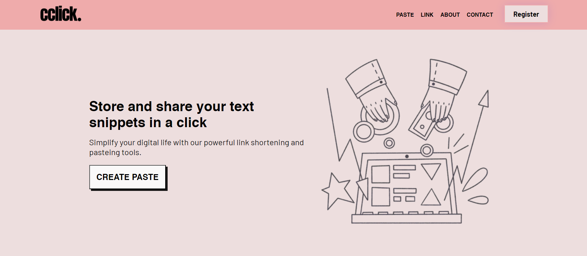

# cclick - Store and share your text snippets



### Features

- Store and share your text and code snippets with anyone.
- Shorten long links with Link Shortner.
- Track number of views on your pastes and links.

### Getting Started

Clone this repository to your local machine:

```
git clone https://github.com/tushgaurav/cclick.click
cd cclick.click
```

Make a .env file inside the root directory with the following values:

```
NEXT_PUBLIC_CLERK_PUBLISHABLE_KEY= <clerk client publishable key. visit clerk.dev>
CLERK_SECRET_KEY= <clerk client secret key. visit clerk.dev>
DATABASE_URL= <database url>
```

Then, run the development server:

```bash
npm run dev
# or
yarn dev
# or
pnpm dev
```

Open [http://localhost:3000](http://localhost:3000) with your browser to see your local cclick.click instance.
